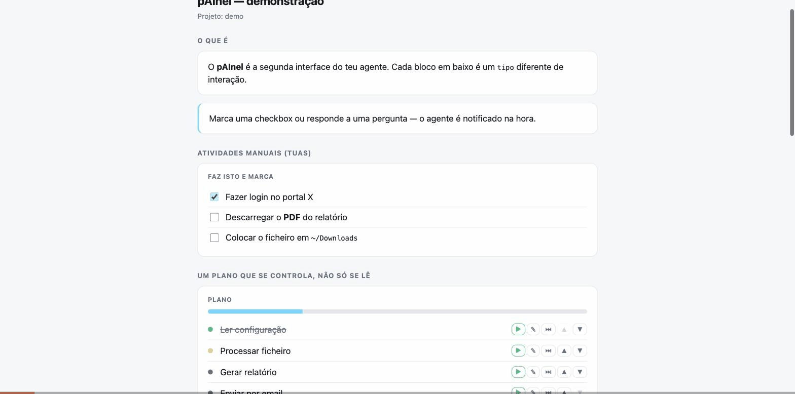

<div align="center">

# p<span>AI</span>nel

**The second interface for your CLI agent.**

Turn a long, scrolling chat with Claude Code (or any terminal agent) into an
organized, clickable dashboard — checkboxes for the manual steps *you* do,
questions with answer boxes, approval buttons, live progress. One file. No
dependencies. Works with any agent that can write JSON.



</div>

---

## The problem

Agentic coding tools are incredibly capable, but everything lives in one
scrolling conversation. On anything longer than a few steps you lose the thread:
*What's the plan? What did it decide? What is it waiting for me to do?*

Non-technical users feel this most. They can drive an agent, but the chat format
gives them nowhere to **see the state** or **act on it** without typing a reply
into the void.

## The idea

pAInel gives the agent a **second screen** next to the chat. The agent composes
the page out of **typed blocks**, and each block knows how to render itself and
what interaction it hands back:

| Block | What you see | What the agent gets back |
|-------|--------------|--------------------------|
| `checklist` | Checkboxes for **your** manual steps | An event the moment you tick one |
| `plan` | A steerable plan: ▶ play, ✎ edit, ⏭ skip, ▲▼ reorder each step | Jump the queue, rewrite a step, or drop it — live |
| `tasks` | The agent's own progress (done / doing / blocked) | — (read-only) |
| `question` | A prompt with a text box | Your typed answer |
| `choice` | A prompt with option buttons | The option you picked |
| `approval` | A proposal with Approve / Reject | Your decision + comment |
| `form` | Several labelled fields | The filled object |
| `resources` | Live docs / mockups / links, always current | — (read-only) |
| `upload` | A drag-and-drop zone the agent points at a folder it chose | The files you drop, written to disk + a `file_added` event |
| `markdown` / `note` / `heading` / `log` | Formatted context | — (read-only) |

The killer case: **the agent needs you to do something by hand** — log into a
portal, download a file, confirm a payment. It drops a `checklist`, keeps
working on everything else, and the instant you tick the box it continues. No
copy-pasting "done" into chat.

## How it works

```
┌─────────────┐   writes    ┌────────────┐   renders   ┌─────────┐
│  the agent  │ ──────────▶ │ board.json │ ──────────▶ │ browser │
└─────────────┘             └────────────┘             └─────────┘
       ▲                          ▲                          │
       │   one JSONL line per     │      you click / type    │
       └──────── interaction ◀────┴──────────────────────────┘
```

- **Input:** a `board.json` — an ordered list of typed blocks, living in your
  project directory, next to the work.
- **Output:** every interaction is written back into `board.json` **and**
  appended as one JSON line to that board's own `<board>.log`, so the agent can
  react in real time by tailing it.

That's the whole protocol. Any agent that can write a JSON file and read lines
from another can use pAInel.

## Quick start

Just Python 3 (standard library only, no runtime dependencies).

```bash
pip install -e .          # or: pipx install .  /  see "Installing" below
```

Then, in any project directory, **one command**:

```bash
painel open
```

That's it. First run creates `.painel-board.json`, registers the project, starts
the **service** if it isn't already up, and opens your board at
`http://localhost:8765/<your-project>`. Run it again anytime — it's idempotent.
Useful companions:

```bash
painel add /path/to/project   # register a project without opening it
painel remove <slug>          # unregister (never deletes the board file)
painel status                 # is the service up? where? how many projects?
painel lint [dir]             # flag checklist items that need an answer, not a tick (exit 1 if any)
painel stop                   # stop the service
painel demo                   # see every block type in a showcase board
painel restart-all            # restart the service (run this after an upgrade)
```

No need to remember ports or ask your agent to start it for you.

### One service, one address, every project

There is **one** pAInel process on your machine, on one fixed port, serving
every project you've registered:

| URL | What it is |
|---|---|
| `http://localhost:8765/` | **The directory** — every registered project as a card: title, pending count, and whether its agent is working/waiting/offline |
| `http://localhost:8765/livrete` | that project's board |
| `http://localhost:8765/livrete/Financeiro` | a specific page of it |

Bookmark `http://localhost:8765/` once and you're done. The directory lists your
**projects**, not your running processes — a project shows up whether or not an
agent is currently working on it, which is the point. A project whose board file
has moved or been deleted is shown as visibly missing rather than silently
disappearing, so you can diagnose it (`painel remove <slug>` to drop it).

Each project's URL comes from a **slug** derived once from its `meta.project`
(or its directory name) — `Livrete` → `/livrete`, `rececao.pt` → `/rececao-pt`.
It's generated once and stored, so retitling a board never breaks your bookmark.

Every board page carries a **breadcrumb** (`Todos os projetos › <projeto> ›
<página>`) and a persistent **project switcher** in the sidebar: it lists every
registered project with its own pending count, so work waiting on you *in other
projects* is visible without going back to the directory — the count travels
with you. Your board's own pending items stay in the attention bar up top; the
switcher badges are strictly for the *other* projects. (Under a single-board
`painel serve` there's no directory, so the switcher just shows the one board.)

> `version` and `event` are reserved page names: a page called either is
> unreachable at `/<slug>/version` / `/<slug>/event`. Known limitation.

**Bulk-adding your existing projects** — pAInel deliberately never scans your
filesystem guessing what you want registered, so add them explicitly:

```bash
for d in ~/projects/*/; do
  [ -f "$d/.painel-board.json" ] && painel add "$d"
done
painel status   # confirm the count
```

Chrome and Firefox also resolve any `*.localhost` subdomain to your own machine
with zero configuration (no `/etc/hosts` edit, no sudo), so
`http://livrete.localhost:8765/livrete` works if you like vanity bookmarks — but
the **path**, not the hostname, is what selects the board; the subdomain is
cosmetic and pAInel doesn't route on it.

Then point your agent at `board.json`. When someone interacts, that board's own
`.painel-board.json.log` gets a line like:

```json
{"event":"check","block":"cl","item":"c1","checked":true}
{"event":"answer","block":"q1","value":"send it to ana@acme.com"}
{"event":"approve","block":"ap","decision":"approved","comment":"go ahead"}
```

Each project gets **only its own** events, so the agent working in that
directory just tails that one file:

```bash
tail -n0 -F .painel-board.json.log | grep --line-buffered '^{'
```

### ⚠️ Security: pAInel has no authentication, on purpose

**Read this before exposing pAInel anywhere.** Boards routinely accumulate
secrets — test-account passwords in a `form` block, tokens, client data. pAInel
implements **no authentication at all**, deliberately: homegrown auth is exactly
where projects like this get holed, and edge authentication is both stronger and
free.

- **It binds `127.0.0.1` by default** and always has. Only you, on your own
  machine, can reach it.
- **A non-loopback `--host` is refused** unless you pass an explicit
  `--i-know-this-is-exposed` acknowledgement. A footgun a typo can trigger is a
  defect, not a feature.
- **🚨 Tunnels bypass all of the above.** A tunnel (`cloudflared`, `ngrok`, `ssh
  -R`, …) runs *on your machine* and connects *to loopback* — so it publishes
  pAInel to the internet while pAInel still binds `127.0.0.1` and believes it is
  private. The bind address cannot save you here; nothing in pAInel can.
  **Put edge authentication in front of it — Cloudflare Access or equivalent —
  before pointing any tunnel at pAInel.** Without that, you have published every
  credential on every board to anyone with the URL.
- **The `upload` block writes to disk.** When the human drops files into an
  `upload` block (or the global "📎 Enviar ficheiros" affordance at the bottom
  of every board), they're saved under the project directory — next to
  `board.json`, never uploaded anywhere remote. Filenames are sanitized, capped
  at 25 MB, and can never escape the project dir. This is one more reason the
  loopback-by-default + edge-auth-before-tunnel rule above matters: an exposed
  service is not only readable, it's now a place strangers can *write* files.

### Handing files to the agent — the `upload` block

The inverse of `resources`: instead of the agent showing you files, **you** drop
files in and the agent picks up where they landed. The agent composes an
`upload` block choosing the destination (`dest_dir`, relative to the project),
so you never have to know or ask a path — you just drag and drop. Every board
also has a persistent global **📎 Enviar ficheiros para o agente** drop zone at
the bottom (files go to `painel-uploads/`), so there is always somewhere to hand
over a file the agent didn't explicitly ask for. Each dropped file is written to
disk and emits a `file_added` event the agent reacts to.

### Catching the wrong block before you see it — `painel lint`

The most common mistake an agent makes composing a board is putting something
in a **checklist** that isn't a yes/no step: *"Ter pelo menos 2 contas de
condutor de teste"*, *"Responder às perguntas do README (nome, projetos,
email)"*. Ticking those tells the agent nothing — the information you were
supposed to hand over is swallowed by a checkbox. Those should have been a
`question` or a `form`.

Writing the rule in the skill didn't stop it (twice), so it's mechanical now:

```bash
painel lint          # exit 1 if anything is flagged, 0 if clean
```

It flags checklist items that look like they want an *answer* rather than a
*tick* (ending in `?`, or containing `responder`, `qual`, `quanto`, `definir`,
`escolher`, `preencher`, `confirmar com`…), and the skill tells the agent to
run it after composing or updating any board. It's deliberately conservative —
it would rather miss one than cry wolf, because a noisy linter gets ignored.

If a flagged item still makes it onto the page, it renders with a small inline
⚠ next to it. Hover it and it tells you what's likely wrong; the fix is the ❓
button already beside every checklist item — click it, say "this needs an
answer field", and the agent converts the block. The warning never blocks or
hides anything; it just makes the mistake visible from both sides.

## Using it inside Claude Code

pAInel ships with a Claude Code **skill** (`.claude/skills/painel/`). Install
it into any project with one command:

```bash
painel install-skill /path/to/your/project   # defaults to the current dir
```

This creates a **symlink**, never a copy — the project always sees the exact
same file as this repo, with zero extra step when the skill itself improves.
(A copy would drift stale the moment you fix something here; there is only
ever one real copy of the skill on your machine.) Re-running the command is
always safe — it's a no-op if the link already points at the right place.

Once installed, the agent learns to:

1. Compose a `board.json` for the session,
2. Serve it and open it next to the chat,
3. Watch for your interactions and react — all on its own.

See [`.claude/skills/painel/SKILL.md`](.claude/skills/painel/SKILL.md).

## Using it with other agents

No skill system required — any agent that can write JSON and run a shell
command can use pAInel. Guides for agents without Claude Code's background
event stream:

- [Cursor](docs/cursor.md)
- [Aider](docs/aider.md)

## Installing

pAInel has zero runtime dependencies, but `pip install` on newer macOS/Homebrew
Python refuses system-wide installs (PEP 668). The clean way:

```bash
python3 -m venv ~/.painel-venv
~/.painel-venv/bin/pip install -e /path/to/painel
mkdir -p ~/.local/bin
ln -sf ~/.painel-venv/bin/painel ~/.local/bin/painel   # make sure ~/.local/bin is on PATH
```

Or, if you have `pipx`: `pipx install /path/to/painel`.

## Board schema

```json
{
  "title": "My session",
  "meta": { "project": "acme", "updated_at": "2026-07-02 21:00" },
  "blocks": [
    { "id": "h1", "type": "heading", "text": "What we're doing" },
    { "id": "m1", "type": "markdown", "text": "Goal: **migrate** the billing job." },
    { "id": "cl", "type": "checklist", "title": "Do these by hand", "items": [
      { "id": "c1", "text": "Log into the billing portal", "checked": false }
    ]},
    { "id": "tk", "type": "tasks", "title": "Progress", "items": [
      { "text": "Read config", "status": "done" },
      { "text": "Run migration", "status": "wip" }
    ]},
    { "id": "q1", "type": "question", "prompt": "Which environment?", "answer": null },
    { "id": "ap", "type": "approval", "prompt": "Deploy now?", "decision": null }
  ]
}
```

Task statuses: `done`, `wip`, `pending`, `blocked`.
Note tones: `info`, `ok`, `warn`, `danger`.

## Design principles

- **Zero dependencies.** One Python file you can read in ten minutes. It should
  run anywhere Python does, forever.
- **Agent-agnostic.** The protocol is just JSON in and JSONL out. Claude Code is
  the first integration, not the only one.
- **The human is a first-class actor.** Most agent UIs assume the agent does
  everything. pAInel is built around the moments a human has to step in.
- **No typing tax.** Ticking a box beats typing "ok done" — especially for
  non-technical users.

## Status

Early but working. v0.1 — the core protocol and all block types are implemented
and tested. Feedback and contributions welcome.

## License

MIT © Rafael Lopes
